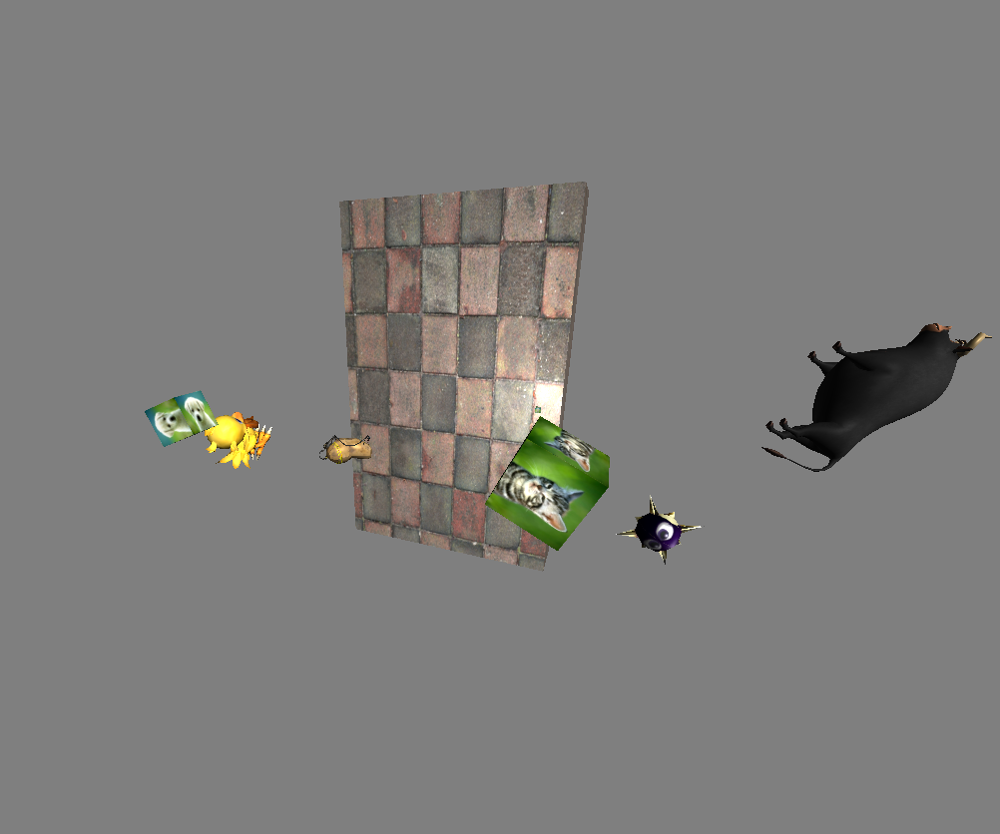

# ModernOpenGL Project

**Author :** GOUPIL Kristian

For ISART Digital

<hr /><br />

## **Project description :**
This project was made in order to learn how OpenGL 3.0+ works and to be introduced to GLSL.

## **Commands :**
- Keep Right click engaged in window, like in Unity's editor:
    - W/S : Move forward/backward
    - A/D : Move left/right
    - Shift/Spacebar: Move up/down
    - Mouse : Look in a direction

## **Code to test features:**
```cpp
// In (App.cpp):InitResources
//      Texture creation:
Resources::Texture* textureName = mManager.Create<Resources::Texture>("textureUnorderedMapName", "texturePath");


// The first time a model is parsed, it will be put in a .bin file in a binary format in order to read it faster during following launches
//      Model creation:
Resources::Model* modelName = mManager.Create<Resources::Model>("modelUnorderedMapName", "modelPath");


//      Object instantiation:
// If the desired object will be at the root of the scene:
mGraph.RootChildren.push_back(
    {
        DataStructure::GameObject(
            Physics::Transform( // Position and Rotation are set to 0 by default and Scale to 1
                Vec3(desiredPositionX, desiredPositionY, desiredPositionZ),
                Vec3(desiredScaleX, desiredScaleY, desiredScaleZ),
                Vec3(desiredRotationX, desiredRotationY, desiredRotationZ)
            ),
            LowRenderer::Mesh(desiredModel, shaderProgram, desiredTexture)
        )
    }
);

// Else, if it's a child of another object:
DataStructure::SceneNode newObject{ /* sameAsAbove */ };
newObject.Parent = &mGraph.RootChildren[0];           // Pointer adress of the desired parent in the graph
mGraph.RootChildren[0].Children.push_back(newObject); // Add the newObject to the children vector of his parent


//      Light creation:
// Directional light
mDirectionalLights.push_back(
    LowRenderer::DirectionalLight(
        Vec3(directionX, directionY, directionZ),
        Vec4(redValue, greenValue, blueValue, alphaValue), // Ambient  color, default to 1
        Vec4(redValue, greenValue, blueValue, alphaValue), // Diffuse  color, default to 1
        Vec4(redValue, greenValue, blueValue, alphaValue)  // Specular color, default to 1
    )
);

// Point light
mPointLights.push_back(
    LowRenderer::PointLight(
        Vec3(positionX, positionY, positionZ),
        Vec4(redValue, greenValue, blueValue, alphaValue), // Ambient  color, default to 1
        Vec4(redValue, greenValue, blueValue, alphaValue), // Diffuse  color, default to 1
        Vec4(redValue, greenValue, blueValue, alphaValue), // Specular color, default to 1
        Vec3(constant, linear, quadratic)                  // Attenuation values, default values are for a max distance of 50 units
        // attenuation = 1.0 / (light.constant + light.linear * distance + light.quadratic * distance ^ 2)
    )
);

// Spot light
mSpotLights.push_back(
    LowRenderer::SpotLight(
        Vec3(positionX, positionY, positionZ),
        Vec3(directionX, directionY, directionZ),
        innerCutOff,                                       // Do not put the angle as a value but the cosine of the desired angle, default to 0
        outerCutOff,                                       // Same as above
        Vec4(redValue, greenValue, blueValue, alphaValue), // Ambient  color, default to 1
        Vec4(redValue, greenValue, blueValue, alphaValue), // Diffuse  color, default to 1
        Vec4(redValue, greenValue, blueValue, alphaValue), // Specular color, default to 1
        Vec3(constant, linear, quadratic)                  // Attenuation values, default values are for a max distance of 50 units
    );
```

## **Default scene screenshot:**


## **Project architecture:**
```sh
.
│   .gitattributes
│   .gitignore
│   README.md
│
├───OpenGL
│   │
│   ├───DLL
│   │
│   ├───Headers
│   │   │   App.hpp
│   │   │
│   │   ├───DataStructure
│   │   │       GameObject.hpp
│   │   │       Graph.hpp
│   │   │
│   │   ├───Debug
│   │   │       Assertion.hpp
│   │   │       Log.hpp
│   │   │
│   │   ├───LowRenderer
│   │   │       Camera.hpp
│   │   │       Light.hpp
│   │   │       Mesh.hpp
│   │   │
│   │   ├───Maths
│   │   │       Mat4.hpp
│   │   │       TestMath.hpp
│   │   │       Vec2.hpp
│   │   │       Vec3.hpp
│   │   │       Vec4.hpp
│   │   │
│   │   ├───Physics
│   │   │       Transform.hpp
│   │   │
│   │   └───Resources
│   │           IResource.hpp
│   │           Model.hpp
│   │           ResourceManager.hpp
│   │           Shader.hpp
│   │           Texture.hpp
│   │
│   ├───Includes
│   │   ├───glad
│   │   │
│   │   ├───GLFW
│   │   │
│   │   ├───glm
│   │   │
│   │   ├───KHR
│   │   │
│   │   └───STB_Image
│   │
│   ├───Libs
│   │
│   ├───Resources
│   │   ├───Obj
│   │   │       chocobo.obj
│   │   │       cube.obj
│   │   │       Ferdinand.obj
│   │   │       Gordo.obj
│   │   │       potatOS.obj
│   │   │
│   │   ├───Shaders
│   │   │       shader.frag
│   │   │       shader.vert
│   │   │
│   │   └───Textures
│   │           cat.png
│   │           chocobo.png
│   │           dog.png
│   │           ferdinand.png
│   │           Gordo.png
│   │           potatOS.png
│   │           wall.jpg
│   │
│   ├───Sources
│   │   │   App.cpp
│   │   │   glad.c
│   │   │   main.cpp
│   │   │
│   │   ├───DataStructure
│   │   │       GameObject.cpp
│   │   │       Graph.cpp
│   │   │
│   │   ├───Debug
│   │   │       Log.cpp
│   │   │
│   │   ├───LowRenderer
│   │   │       Camera.cpp
│   │   │       Light.cpp
│   │   │       Mesh.cpp
│   │   │
│   │   ├───Maths
│   │   │       Mat4.cpp
│   │   │       TestMath.cpp
│   │   │       Vec2.cpp
│   │   │       Vec3.cpp
│   │   │       Vec4.cpp
│   │   │
│   │   ├───Physics
│   │   │       Transform.cpp
│   │   │
│   │   └───Resources
│   │           Model.cpp
│   │           ResourceManager.cpp
│   │           Shader.cpp
│   │           Texture.cpp
│   │
│   ├───stb-master
│   │
│   └───x64
│
└───x64
``` 

Code editor : Visual Studio
<br />
Operating system : Windows 10
